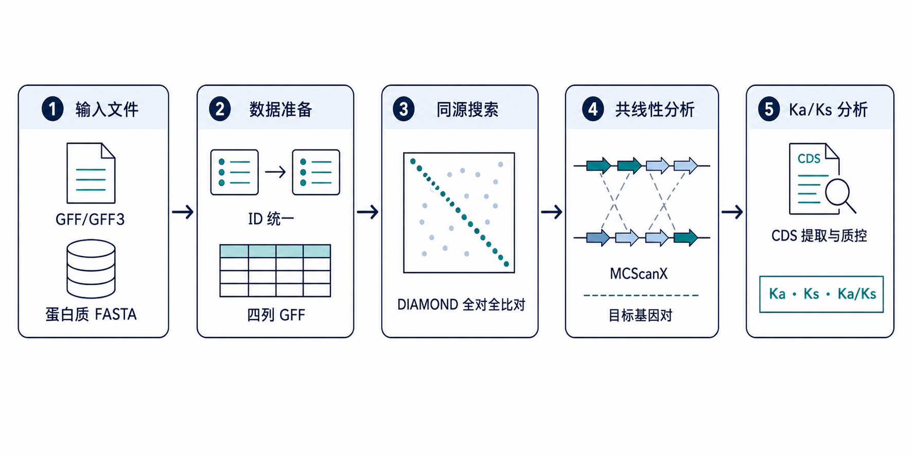

<h1 align="center">共线性分析与 Ka/Ks 分析流程</h1>

<p align="center">
  
  
  
  
  
  
</p>

本仓库提供一个可复用的种内或种间共线性分析与 Ka/Ks 分析模板。它从 GFF/GFF3 注释和蛋白 FASTA 出发，辅助生成 MCScanX 输入、筛选目标基因相关的共线性基因对、提取 CDS，并在 Ka/Ks 计算前检查序列质量。

本仓库只包含流程、脚本和示例配置，不包含真实基因组、注释、序列或分析结果。

## 项目能做什么

- 清理蛋白 FASTA 的序列标题；
- 从 GFF/GFF3 提取与蛋白 ID 对应的坐标，生成 MCScanX 四列 GFF；
- 配合 DIAMOND 完成蛋白质全对全比对；
- 配合 MCScanX 或 TBtools-II 识别共线性区块；
- 从 `.collinearity` 文件筛选与目标基因有关的共线性基因对；
- 从全量 CDS FASTA 提取候选基因对对应的 CDS；
- 检查 CDS 长度、起始密码子、终止密码子和非法字符；
- 配合 TBtools-II 计算 Ka、Ks 和 Ka/Ks。

## 项目边界

这不是一条全自动的一键式流水线。仓库中的 Python 脚本负责数据准备、筛选和质量检查；DIAMOND、MCScanX 和 Ka/Ks 计算由外部软件完成。

本仓库不会：

- 自动下载参考基因组或注释；
- 自动安装 DIAMOND、MCScanX、TBtools-II 或 gffread；
- 自动判断 GFF 中应该使用哪一种 ID 字段；
- 自动完成密码子比对或替代率估算；
- 替代对同源关系、基因模型和异常 Ka/Ks 结果的人工检查。

## 工作流程

<p align="center">
  
</p>

## 运行环境

推荐使用 Linux、macOS 或 Windows Subsystem for Linux（WSL）。下面的命令以 Bash 和 `python3` 为例。

必需软件：

- Python 3；仓库脚本只使用 Python 标准库，不需要安装额外的 Python 包；
- [DIAMOND](https://github.com/bbuchfink/diamond)；
- [TBtools-II](https://github.com/CJ-Chen/TBtools-II)，用于图形界面的 MCScanX 和 Ka/Ks 计算。

可选软件：

- [gffread](https://github.com/gpertea/gffread)，当只有 genome FASTA 和 GFF/GFF3、没有 CDS FASTA 时使用；
- [MCScanX](https://github.com/wyp1125/MCScanX)，如需不用 TBtools-II、直接在命令行运行 MCScanX。

安装后建议先检查：

```bash
python3 --version
diamond version
gffread --version    # 仅在需要时检查
```

TBtools-II 为图形界面程序，需要单独启动并确认可以正常打开。

## 仓库结构

```text
.
├── scripts/
│   ├── prepare_mcscanx_inputs.py
│   ├── filter_collinearity_targets.py
│   ├── extract_cds_by_ids.py
│   └── validate_cds_lengths.py
├── configs/
│   ├── targets.example.txt
│   └── kaks_pairs.example.tsv
├── data/
│   ├── raw/
│   └── intermediate/
├── results/
│   ├── mcscanx/
│   └── kaks/
├── docs/
│   └── workflow.zh-CN.md
├── .gitignore
├── LICENSE
└── README.md
```

`data/` 和 `results/` 中的真实数据及结果默认被 `.gitignore` 排除。

## 快速开始

### 1. 获取仓库

```bash
git clone https://github.com/Oblivionis028/Bioinfo-collinearity-kaks-pipeline.git
cd Bioinfo-collinearity-kaks-pipeline
```

### 2. 准备输入文件

将原始文件放在本地：

```text
data/raw/genome.gff
data/raw/protein.fasta
```

Ka/Ks 分析还需要以下两种输入方式之一：

```text
data/raw/all.cds.fa
```

或者：

```text
data/raw/genome.fasta
data/raw/genome.gff
```

输入要求：

| 文件 | 必需 | 关键要求 |
|---|---|---|
| GFF/GFF3 | 是 | 必须能从指定 feature 和 attribute 中取得与蛋白 FASTA 一致的 ID |
| protein FASTA | 是 | 每条序列标题中空格前的第一个字段作为蛋白 ID |
| CDS FASTA | Ka/Ks 必需 | CDS ID 必须与候选基因对中的 ID 完全一致 |
| genome FASTA | 条件必需 | 仅在需要通过 gffread 生成 CDS 时使用 |

### 3. 先确认 GFF 与蛋白 ID 能对应

这是整个流程最容易出错的步骤。

脚本默认从 GFF 的 `CDS` 行读取：

```text
Protein_Accession=...
```

并将其与 protein FASTA 标题中空格前的 ID 对应。先查看实际 GFF：

```bash
grep -v '^#' data/raw/genome.gff | grep -m 3 $'\tCDS\t'
grep -m 3 '^>' data/raw/protein.fasta
```

如果 GFF 使用 `protein_id=...`：

```bash
python3 scripts/prepare_mcscanx_inputs.py \
  --gff data/raw/genome.gff \
  --protein data/raw/protein.fasta \
  --prefix TK \
  --outdir data/intermediate \
  --feature_type CDS \
  --protein_attr protein_id
```

如果蛋白 ID 对应在 `mRNA` 行的 `ID=...`：

```bash
python3 scripts/prepare_mcscanx_inputs.py \
  --gff data/raw/genome.gff \
  --protein data/raw/protein.fasta \
  --prefix TK \
  --outdir data/intermediate \
  --feature_type mRNA \
  --protein_attr ID
```

不要直接照搬这两个例子。`--feature_type` 和 `--protein_attr` 必须根据自己的 GFF 内容确定。

### 4. 生成 MCScanX 输入

如果 GFF 使用脚本默认的 `CDS` 与 `Protein_Accession`：

```bash
python3 scripts/prepare_mcscanx_inputs.py \
  --gff data/raw/genome.gff \
  --protein data/raw/protein.fasta \
  --prefix TK \
  --outdir data/intermediate
```

生成：

```text
data/intermediate/TK.clean.protein.fasta
data/intermediate/TK.gff
```

`TK.gff` 是 MCScanX 四列格式：

```text
chromosome_or_scaffold    protein_id    start    end
```

脚本结束时会打印：

```text
Protein records in FASTA
Protein IDs with coordinates in GFF
Rows written to .../TK.gff
```

`Rows written` 必须大于 0，并且理想情况下应接近 FASTA 中的蛋白数量。如果为 0，或远低于蛋白数量，先解决 ID 不匹配问题，不要继续运行 DIAMOND。

### 5. 运行 DIAMOND 蛋白全对全比对

```bash
cd data/intermediate

diamond makedb \
  --in TK.clean.protein.fasta \
  --db TK

diamond blastp \
  --db TK.dmnd \
  --query TK.clean.protein.fasta \
  --out TK.blast \
  --evalue 1e-5 \
  --max-target-seqs 5 \
  --outfmt 6

cd ../..
```

生成：

```text
data/intermediate/TK.dmnd
data/intermediate/TK.blast
```

`1e-5` 和每条查询最多保留 5 个匹配是示例参数，不是所有物种或研究问题的固定标准。对于重复基因丰富的基因组，过低的 `--max-target-seqs` 可能遗漏同源关系，应根据研究设计调整并在方法中报告。

### 6. 运行 MCScanX

在 TBtools-II 中打开：

```text
Quick Run MCScanX Wrapper
```

设置：

```text
Input .blast File: data/intermediate/TK.blast
Input .gff File:   data/intermediate/TK.gff
Output Directory:  results/mcscanx
```

核心输出应包括：

```text
results/mcscanx/TK.collinearity
```

如果使用命令行版 MCScanX，应确保同一前缀的 `.gff` 和 `.blast` 位于 MCScanX 要求的位置，并参考 MCScanX 官方文档运行。

### 7. 筛选目标基因相关共线性基因对

复制示例配置：

```bash
cp configs/targets.example.txt configs/targets.txt
```

编辑 `configs/targets.txt`，每行一个目标基因或蛋白 ID：

```text
GENE000001
GENE000002
GENE000003
```

运行：

```bash
python3 scripts/filter_collinearity_targets.py \
  --collinearity results/mcscanx/TK.collinearity \
  --gff data/intermediate/TK.gff \
  --targets configs/targets.txt \
  --out_prefix results/mcscanx/target_collinearity
```

生成：

```text
results/mcscanx/target_collinearity_pairs.tsv
results/mcscanx/target_collinearity_summary.tsv
```

`pairs.tsv` 保存每个目标基因与其共线性伙伴、所在区块和坐标；`summary.tsv` 汇总每个目标基因是否命中、伙伴基因数量、区块数量及同染色体或异染色体关系。

该脚本按 MCScanX 标准 `.collinearity` 文本格式解析基因对。若使用修改过的输出格式，应抽查结果是否正确。

### 8. 准备 Ka/Ks 基因对

复制示例：

```bash
cp configs/kaks_pairs.example.tsv configs/kaks_pairs.tsv
```

编辑 `configs/kaks_pairs.tsv`。每行两个基因 ID，以 Tab 分隔，不要添加表头：

```text
GENE000001<Tab>GENE000002
GENE000003<Tab>GENE000004
```

生成后续 CDS 提取所需的去重 ID 列表：

```bash
awk '{print $1; print $2}' configs/kaks_pairs.tsv \
  | sort -u \
  > configs/kaks_ids.txt
```

检查：

```bash
cat configs/kaks_ids.txt
```

### 9. 获取并提取 CDS

如果已经有全量 CDS FASTA：

```bash
python3 scripts/extract_cds_by_ids.py \
  --cds data/raw/all.cds.fa \
  --ids configs/kaks_ids.txt \
  --out results/kaks/target.cds.fa
```

脚本会打印：

```text
Found: 已找到数量 / 请求数量
Missing: 未找到的 ID
```

`Found` 应等于请求数量。只要存在 Missing，就应先检查 CDS FASTA 标题与候选基因对的 ID 是否一致。

如果没有 CDS FASTA，但有 genome FASTA 与 GFF/GFF3：

```bash
gffread data/raw/genome.gff \
  -g data/raw/genome.fasta \
  -x data/intermediate/all.cds.fa

python3 scripts/extract_cds_by_ids.py \
  --cds data/intermediate/all.cds.fa \
  --ids configs/kaks_ids.txt \
  --out results/kaks/target.cds.fa
```

注意：gffread 输出的 FASTA ID 可能是转录本 ID，而候选基因对可能使用蛋白 ID。运行前用下面的命令抽查：

```bash
grep -m 5 '^>' data/intermediate/all.cds.fa
head configs/kaks_ids.txt
```

### 10. 检查 CDS

```bash
python3 scripts/validate_cds_lengths.py \
  --cds results/kaks/target.cds.fa \
  > results/kaks/cds_validation.tsv
```

输出字段：

| 字段 | 含义 |
|---|---|
| `length` | CDS 长度 |
| `multiple_of_3` | 长度是否为 3 的倍数 |
| `starts_with_ATG` | 是否以 ATG 开始 |
| `ends_with_stop` | 是否以 TAA、TAG 或 TGA 结束 |
| `invalid_bases` | 是否含 ATCGN 以外的字符 |

某些合法基因模型可能没有标准起始或终止密码子，因此检查结果是质量控制提示，不是自动删除规则。用于 Ka/Ks 的两个 CDS 仍应代表正确的同源编码序列，并保持可比的阅读框。

### 11. 计算 Ka/Ks

在 TBtools-II 中打开：

```text
Simple Ka/Ks Calculator (NG)
```

设置：

```text
Input CDS File:      results/kaks/target.cds.fa
Input GenePair File: configs/kaks_pairs.tsv
Output Table File:   results/kaks/kaks.result.tsv
```

计算完成后至少保存并检查：

- Gene 1 与 Gene 2；
- Ka；
- Ks；
- Ka/Ks；
- 失败、NaN 或无穷值；
- 实际使用的软件版本和参数。

## 主要输出

| 文件 | 用途 |
|---|---|
| `TK.clean.protein.fasta` | 标题清理后的蛋白 FASTA |
| `TK.gff` | MCScanX 四列坐标文件 |
| `TK.blast` | DIAMOND 表格输出 |
| `TK.collinearity` | MCScanX 共线性区块 |
| `target_collinearity_pairs.tsv` | 目标相关共线性基因对及坐标 |
| `target_collinearity_summary.tsv` | 目标基因命中情况汇总 |
| `kaks_ids.txt` | 候选基因对涉及的去重 ID |
| `target.cds.fa` | 候选基因对 CDS |
| `cds_validation.tsv` | CDS 基础质量检查 |
| `kaks.result.tsv` | Ka/Ks 计算结果 |

## 结果解释

常用的初步解释如下：

| Ka/Ks | 常见解释 |
|---|---|
| `< 1` | 与纯化选择一致 |
| `≈ 1` | 与近中性演化一致 |
| `> 1` | 可能存在正选择或功能分化 |
| `NaN`、`Inf` | 当前数据下无法稳定估算，不能直接用于选择压力判断 |

这些判断不能脱离 Ka、Ks、序列比对质量和基因复制历史单独使用。尤其需要注意：

- Ka/Ks 是针对一对同源编码序列计算，不是单个基因的属性；
- Ks 过高可能出现替换饱和；
- Ka 或 Ks 接近 0 时，比值可能不稳定；
- 单个基因对 `Ka/Ks > 1` 不能单独证明适应性进化；
- 错误的 CDS、阅读框、转录本对应关系或同源关系会直接导致错误结论。

## 常见问题

### `Rows written` 为 0

原因通常是 `--feature_type` 或 `--protein_attr` 与 GFF 内容不一致。检查 GFF 第三列 feature 类型和第九列属性。

### 只有少量蛋白写入 `TK.gff`

蛋白 FASTA ID 与 GFF 中提取的 ID 只部分匹配。分别抽取两个文件的 ID，检查版本号、前缀、转录本后缀和空格后的描述信息。

### TBtools-II 或 MCScanX 报告 ID 不一致

确认：

```text
TK.clean.protein.fasta 中的 ID
= TK.blast 第 1、2 列中的 ID
= TK.gff 第 2 列中的 ID
```

### 目标基因全部显示 `found_in_collinearity = NO`

检查目标列表使用的是 gene ID、transcript ID 还是 protein ID。它必须与 `TK.gff` 第 2 列和 `.collinearity` 中的 ID 完全一致。

### CDS 提取出现 Missing

候选基因对 ID 与 CDS FASTA 标题不一致。不要仅通过模糊字符串替换强行对应，应回到注释文件建立明确的 gene、transcript 与 protein 映射。

### Ka/Ks 出现 NaN

可能原因包括 Ka 与 Ks 同时为 0、有效替换位点不足、序列完全相同、比对或阅读框异常。NaN 不代表纯化选择，也不应替换为 0。

## 数据与隐私

`.gitignore` 默认排除：

- FASTA、GFF/GTF 和 GenBank 文件；
- DIAMOND 数据库与比对结果；
- MCScanX 共线性结果；
- TSV、CSV、Excel、图片、日志和报告；
- `data/raw/`、`data/intermediate/` 和 `results/` 中的实际内容。

上传前仍应运行：

```bash
git status
```

确认没有真实序列、未公开数据、样本信息或分析结果被加入提交。

## 方法记录建议

用于论文或报告时，至少记录：

- 参考基因组、注释和蛋白序列的来源与版本；
- gene、transcript 和 protein ID 的对应规则；
- DIAMOND、MCScanX、TBtools-II 和 gffread 的版本；
- DIAMOND 的 E-value、最大匹配数和输出格式；
- 输入蛋白数量、写入四列 GFF 的数量及匹配比例；
- 共线性区块与共线性基因对数量；
- 目标基因筛选规则；
- CDS 质量控制和异常值排除规则；
- Ka/Ks 计算方法以及 NaN、Inf 和饱和 Ks 的处理原则。

## 许可证

本项目采用 [MIT License](LICENSE)。
